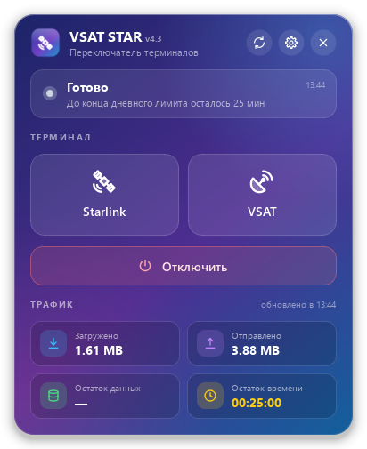

# VSAT STAR S/W

Небольшая программа для Windows: переключает спутниковый интернет на судне между терминалами **Starlink** и **VSAT** в один клик, без входа в веб-панель вручную.



## Возможности

- Переключение Starlink / VSAT и отключение (logout) одной кнопкой
- Статус трафика: загружено, отправлено, остаток данных, остаток времени
- Автообновление трафика каждые 10 минут (браузерная страница обновляется каждые 10 секунд и расходует трафик)
- Напоминание в трее за 30 минут до конца дневного лимита
- Работа из трея: быстрые действия в меню, уведомления о результате
- Логин и пароль хранятся только локально (`vsat_star_settings.db` рядом с программой)
- Горячие клавиши: `F5` обновить трафик, `Ctrl+,` настройки, `Esc` свернуть в трей

## Запуск

```
pip install -r requirements.txt
python gui_app.py
```

При первом запуске откройте настройки (шестерёнка) и введите логин и пароль от панели.

Без интерфейса, из консоли:

```
python terminal_switch.py starlink
python terminal_switch.py vsat
python terminal_switch.py disconnect
```

## Сборка .exe

```
pip install pyinstaller
pyinstaller --onefile --windowed --name Vsat_Star gui_app.py
```

Готовый файл появится в папке `dist`.

## Файлы

| Файл | Назначение |
|---|---|
| `gui_app.py` | Интерфейс (PySide6) |
| `terminal_switch.py` | Запросы к панели: вход, переключение, logout, трафик |
| `settings_store.py` | Локальные настройки (SQLite) |
| `icons.py` | Векторные иконки, генерируются в коде |

## История версий

| Версия | Что нового |
|---|---|
| 1 | Кнопки Starlink / VSAT / Отключить, стеклянный дизайн, журнал |
| 2 | Статус трафика |
| 3.1 | Настройки логина и пароля, работа в трее, трафик без повторного входа |
| 3.1 (сборка exe) | Сброс сессии при смене логина, размер окна под журнал |
| 3.2 | Новый дизайн, нарисованные в коде иконки вместо эмодзи, меню трея, горячие клавиши |
| 3.2 | Правильный разбор трафика на VSAT (время больше не попадает в «остаток данных») |
| 3.2 | Исправлена ошибка запуска |
| 3.2 | Возвращено быстрое переключение терминалов |
| 3.2 | Раздел «О программе» |
| 4.3 | Автообновление каждые 10 минут, напоминание за 30 минут до конца лимита |

## Автор

Sukhoverkhii Dmitrii
